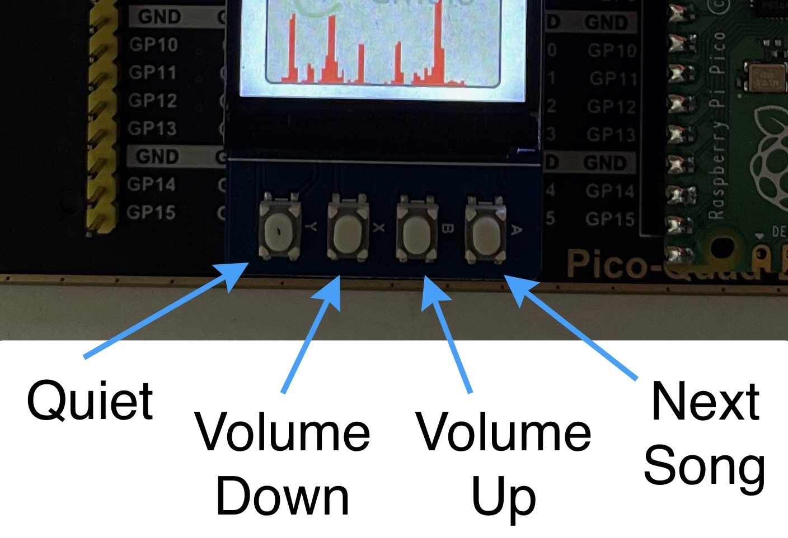

# PicoMusic
Music synthesis and spectrum visualization on RP2040 with [CMSIS-Stream](https://github.com/ARM-software/CMSIS-Stream), [CMSIS-DSP](https://github.com/ARM-software/CMSIS-DSP) and [Arm-2D](https://github.com/ARM-software/Arm-2D) .

## Introduction

The demo is made of 2  [CMSIS-Stream](https://github.com/ARM-software/CMSIS-Stream) graphs. 

* Core 0 executes an Audio graph
* Core 1 executes an LCD graph

The Audio graph synthesizes the sound and sends it to the PWM audio driver and Core 1.

The LCD graph reads the audio data from Core 0 and generates content and position of some layers:

* The spectrum layer
* The amplitude layer
* The CMSIS logo layer

[Arm-2D](https://github.com/ARM-software/Arm-2D) is used as output node of the LCD graph to compose the layers with blending and create the final scene.


https://github.com/christophe0606/PicoMusic/assets/48906714/71928e84-742c-49ad-a4ea-63e5119bedac

With a serial console connected though USB you can control the digital gain of the Audio graph:

* `+` or `=` key to increase the digital gain
* `-` key to decrease the digital gain
* `q` (quiet) to set the gain to `0.0`

The console also displays the name of the song being played. If you have configured several songs in the demo, you can move to the next song with `n` key.


You can also use the buttons below the screen:



To add new songs, you can modify the arrays defined in `Songs/songs.c` and add a reference to your new song:

```C
static const uint8_t* _allSongs[];
static const char* _names[];
```

The songs must be converted from a MIDI into a C array file using the [`miditones`](https://github.com/LenShustek/miditones) tools by Len Shustek.

You can look at the `Songs` folder to see some converted songs.

## Audio graph

The audio graphs synthesizes the music and sends the audio samples to the PWM audio driver and to core 1.

The tool  [`miditones`](https://github.com/LenShustek/miditones) from the  [Playtune_synth_project](https://github.com/LenShustek/Playtune_synth) can be used to convert MIDI files and is configured to use 6 channels by default. That's why the Audio graph only has 6 channels. But it is configurable in the Python scripts and the graph can be modified to have as many channels as needed.

When a channel is not used by a song it has a low overhead (but memory copies are still occurring because buffers can be shared between different "FIFOs" for memory optimization purposes).

A channel is made of a very simple waveform synthesizer followed by a node that changes the envelope of the waveform. 

The channels are mixed with saturating additions.

The sequencer nodes generates commands and control the waveform and envelope nodes.

The audio node sends the audio samples to the PWM driver.

The `core1` node sends data to core 1 in a non blocking way : if core 1 is not fast enough it means some audio packets will be missed.


## LCD Graph

The LCD graph processes the audio coming from core 0 to display the amplitude and spectrum of the synthesized music. It is waiting for audio packets and processing will be halted until a new audio packet is received.

The received audio samples are decimated by a factor of 16 because we only have 240 samples to display and also to avoid having a too high refresh rate of the LCD.

The sound signal is filtered and decimated using the  [CMSIS-DSP](https://github.com/ARM-software/CMSIS-DSP) function `arm_fir_decimate_q15`.

The filter coefficients are defined in `App/Sources/main.cpp` : coefficients of the filter are in the `coefs` array in `q15_t` format. Current filter is a simple comb filter.

A FFT of the decimated signal is computed. The FFT is windowed using a Hanning window. The window is computed in `App/Sources/main.cpp` using the  [CMSIS-DSP](https://github.com/ARM-software/CMSIS-DSP) function `arm_hanning_f32` and `arm_float_to_q15`.

A FFT amplitude with scaling is computed. The scaling has been chosen in an arbitrary way so that the FFT spectrum is well visible on the display. 

A widget nodes takes a layer and some samples and draws something into the layer. Two widgets are defined:

* A spectrum widget that displays a spectrum in a layer from the FFT amplitudes at the input of this widget
* An amplitude widget that displays the sound waveform in a layer

Due to the high decimation factor, don't expect to see high frequencies on the spectrum widget.

The layers are then composed with blending by the [Arm-2D](https://github.com/ARM-software/Arm-2D) node to render the final scene on the LCD.


## Connection to speaker


The transistor is a NPN 2222A. But any other NPN transistor would work. It just need to have a higher bandwidth than audio bandwidth.

Speaker has a resistance of 4 Ω.  You can also put a resistance in series with the speaker is you want to decrease the amount of current drawn from the USB.

The pin number used is coming from 

`pico-extras/blob/master/src/rp2_common/pico_audio_pwm/include/pico/audio_pwm.h` 

and can be changed by redefining some macros:

```C
#ifndef PICO_AUDIO_PWM_L_PIN
#define PICO_AUDIO_PWM_L_PIN 0
#endif

#ifndef PICO_AUDIO_PWM_R_PIN
#define PICO_AUDIO_PWM_R_PIN 1
#endif

#ifndef PICO_AUDIO_PWM_MONO_PIN
#define PICO_AUDIO_PWM_MONO_PIN PICO_AUDIO_PWM_L_PIN
#endif
```

## Connection to LCD

The LCD is https://www.waveshare.com/wiki/Pico-LCD-1.3

And we are using a https://www.waveshare.com/pico-quad-expander.htm to connect the LCD

The pins used comes from the `Arm2D_RP2040` project and are defined in `RP2040/st7789_lcd.h`. They can be changed by redefining some macros:

```C
#ifndef PIN_DIN
#define PIN_DIN 11
#endif 

#ifndef PIN_CLK
#define PIN_CLK 10
#endif 

#ifndef PIN_CS
#define PIN_CS 9
#endif 

#ifndef PIN_DC
#define PIN_DC 8
#endif 

#ifndef PIN_RESET
#define PIN_RESET 12
#endif 

#ifndef PIN_BL
#define PIN_BL 13
#endif 
```

## How to build

First, you need to be able to build the Pico examples and have the pico-extra since the demo is using audio drivers from pico-extra. Refer to the Pico documentation to know what to install.

Once it is working, you can then build this project:

```shell
mkdir build.tmp
cd build.tmp
cmake -DARM2D=/ArmSoftware/Arm-2D \
 -DCMSISDSP=/ArmSoftware/CMSIS-DSP \
 -DCMSISSTREAM=/ArmSoftware/CMSIS-Stream \
 -DCMSISCORE=/ArmSoftware/CMSIS_5/CMSIS/Core \
 -DARM2D_RP2040=/ArmSoftware/Arm2D_RP2040/RP2040 \
 -DHOST=NO ..
make
```

Where `ArmSoftware` is the path where you have installed the Arm libraries.

You can clone the Arm libraries with:

```shell
git clone https://github.com/ARM-software/CMSIS-DSP.git
git clone https://github.com/ARM-software/CMSIS-Stream.git
git clone https://github.com/ARM-software/CMSIS_5.git
git clone https://github.com/ARM-software/Arm-2D.git
git clone https://github.com/christophe0606/Arm2D_RP2040
```

For CMSIS-DSP and Arm-2D, use the develop branch.

The last project Arm2D_RP2040 is providing RP2040 specific optimizations for [Arm-2D](https://github.com/ARM-software/Arm-2D) and is also providing a `CMakeLists.txt` to make it easier to build [Arm-2D](https://github.com/ARM-software/Arm-2D) +  [CMSIS-DSP](https://github.com/ARM-software/CMSIS-DSP) in the Pico environment.

## Copyright and licensing information

### MIDI Project

The MIDI part is coming from the [Playtune_synth_project](https://github.com/LenShustek/Playtune_synth) Copyright (C) 2016, Len Shustek

The [Playtune_synth](https://github.com/LenShustek/Playtune_synth) files have been strongly modified and refactored to be integrated in the [CMSIS-Stream](https://github.com/ARM-software/CMSIS-Stream) framework. They are clearly identified (always inside a [Playtune_synth](https://github.com/LenShustek/Playtune_synth) folder) and Copyright (C) 2016, Len Shustek.

[Playtune_synth](https://github.com/LenShustek/Playtune_synth) files are covered by their original MIT license. 

### Pico SDK and Extras

The [Arm2D_RP2040](https://github.com/christophe0606/Arm2D_RP2040/tree/main) project is using an example of PIO driver for LCD coming from the [pico-examples](https://github.com/raspberrypi/pico-examples/tree/master/pio/st7789_lcd). The example has been modified to be integrated in  [CMSIS-Stream](https://github.com/ARM-software/CMSIS-Stream).

It is Copyright (c) 2020 Raspberry Pi (Trading) Ltd and covered by a BSD-3 license.

The PWM node is based upon a [Pico playground audio example](https://github.com/raspberrypi/pico-playground/tree/master/audio/sine_wave) using the drivers from [pico-extra](https://github.com/raspberrypi/pico-extras/tree/master/src/rp2_common/pico_audio_pwm). The example has been modified to be integrated in  [CMSIS-Stream](https://github.com/ARM-software/CMSIS-Stream).

It is Copyright (c) 2020 Raspberry Pi (Trading) Ltd and covered by a BSD-3 license.

### Other files

Other files are covered by an Apache license and have been developed by Arm.

