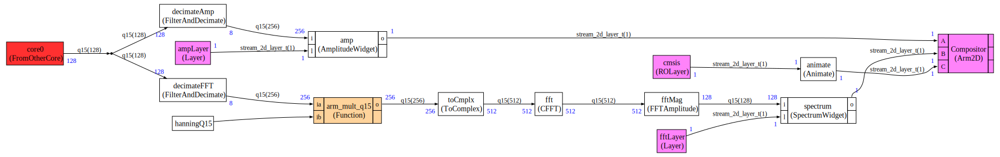

# PicoMusic
Music generation and spectrum visualization on RP2040 with [CMSIS-Stream](https://github.com/ARM-software/CMSIS-Stream) and [CMSIS-DSP](https://github.com/ARM-software/CMSIS-DSP).

## Introduction

The demo is made of 2 CMSIS-Stream graphs. Core0 is running an audio graph.

Core1 is running an LCD graph.

The audio graph is synthesizing the sound and sending it to the PWM driver and Core 1.

The LCD graph is reading the audio data and generating a framebuffer to display a spectrum, amplitude and texture background (with some animation and blending).

[Arm-2D](https://github.com/ARM-software/Arm-2D) is used to compose the UI and generate the content of the layers.


https://github.com/christophe0606/PicoMusic/assets/48906714/b5b29c64-6573-45c1-aa49-301c525b5d82


## Audio graph

The song used for this example has only 6 channels so we have used 6 in the graph. But it is configurable in the Python and can have as many channels as needed.

When a channel is not used by a song it has a low overhead (but memory copies are still occuring because buffers can be shared between different "FIFOs" for memory optimization purposes).


## LCD Graph

Widgets are drawing into a layer using some Arm-2D functions.

The layers are then composed by the Arm-2D node to render the final screen on the LCD.

Signal is decimated because we only have 240 samples to display and also to avoid having a too high refresh rate.



## Connection to speaker


The transistor is a NPN 2222A

Speaker has a resistance of 4 Ω

The LCD is https://www.waveshare.com/wiki/Pico-LCD-1.3

And we are using a https://www.waveshare.com/pico-quad-expander.htm to connect the LCD


## How to build

First, you need to be able to build the Pico examples and have the pico-extra since the demo is using audio drivers from pico-extra. Refer to the Pico documentation to know what to install.

```shell
mkdir build.tmp
cd build.tmp
cmake -DARM2D=/ArmSoftware/Arm-2D \
 -DCMSISDSP=/ArmSoftware/CMSIS-DSP \
 -DCMSISSTREAM=/ArmSoftware/CMSIS-Stream \
 -DCMSISCORE=/ArmSoftware/CMSIS_5/CMSIS/Core \
 -DARM2D_RP2040=/ArmSoftware/Arm2D_RP2040/RP2040 \
 -DHOST=NO ..
make
```

Where `ArmSoftware` is the path where you have installed the Arm libraries.

You can clone the Arm libraries with:

```shell
git clone https://github.com/ARM-software/CMSIS-DSP.git
git clone https://github.com/ARM-software/CMSIS-Stream.git
git clone https://github.com/ARM-software/CMSIS_5.git
git clone https://github.com/ARM-software/Arm-2D.git
git clone https://github.com/christophe0606/Arm2D_RP2040
```

The last project is providing RP2040 specific optimizations for Arm-2D and is also providing a CMakeLists.txt to make it easier to build Arm-2D + CMSIS-DSP in the Pico environment.

## Copyright and licensing information

## MIDI Project

The MIDI part is coming from the [Playtune_synth 
   project](https://github.com/LenShustek/Playtune_synth) Copyright (C) 2016, Len Shustek

The Playtune_synth files have been strongly modified and refactored to be integrated in the CMSIS-Stream framework. They are clearly identified (always inside a Playtune_synth folder) and Copyright (C) 2016, Len Shustek.

Playtune_synth files are covered by their original MIT license. 

## Pico SDK and Extras

The Arm2D_RP2040 project is based upon an example of PIO driver from the Pico examples. The example has been modified to be integrated in CMSIS-Stream.

It is Copyright (c) 2020 Raspberry Pi (Trading) Ltd and covered by a BSD-3 license.

The PWM node is based upon a Pico playground audio example using the drivers from pico-extra.The example has been modified to be integrated in CMSIS-Stream.

It is Copyright (c) 2020 Raspberry Pi (Trading) Ltd and covered by a BSD-3 license.

## Other files

Other files are covered by an Apache licence and have been developped by Arm.

